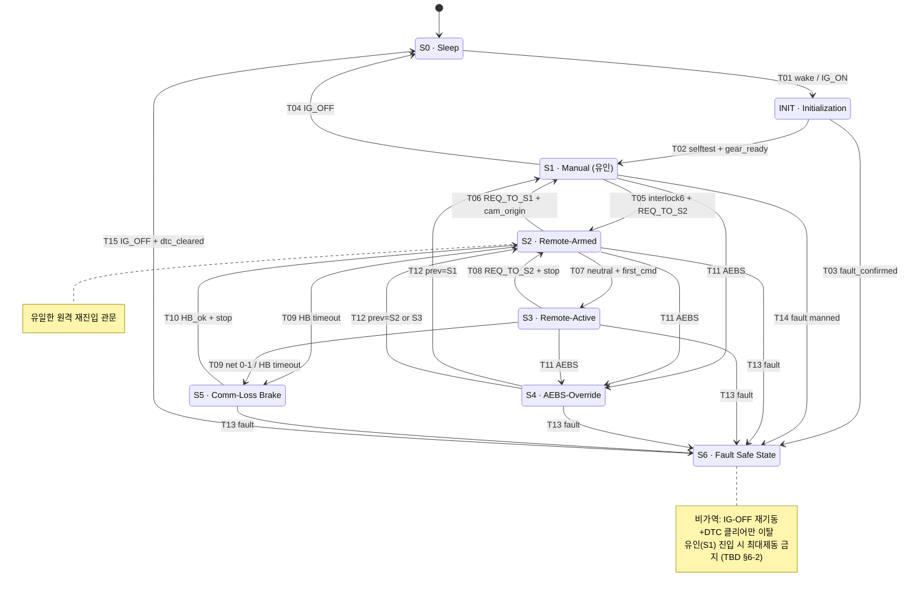
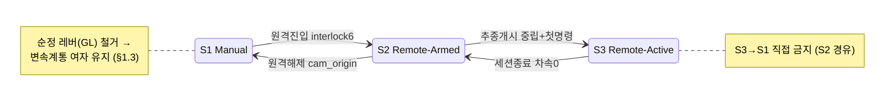
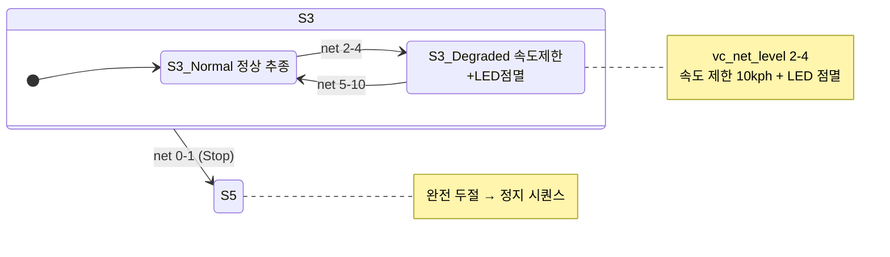
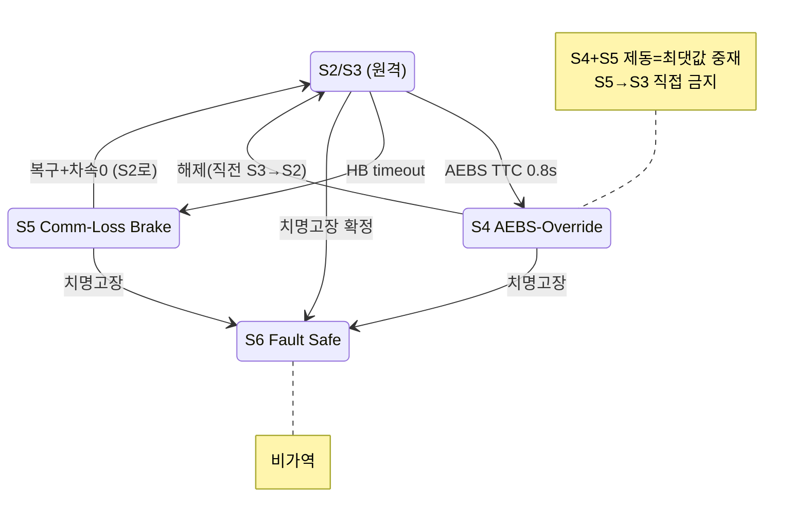
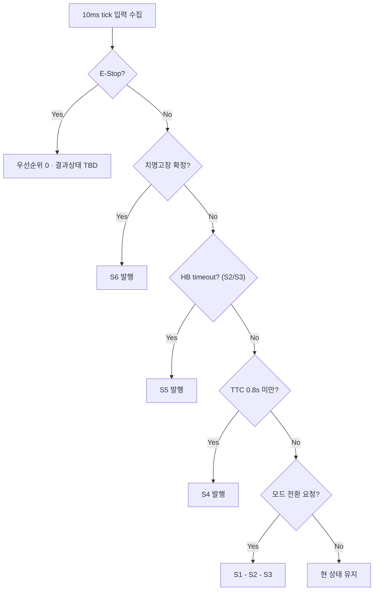
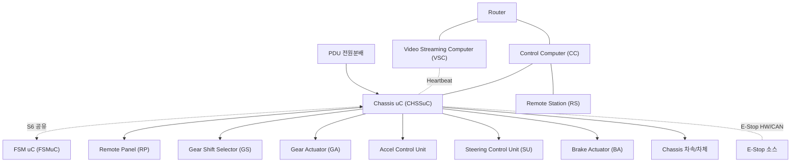
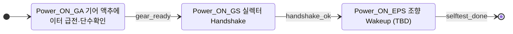

# Mermaid 상태 다이어그램

> 상태 카드(`08`)·전이표(`01`)를 Mermaid 로 도식화. 명칭은 명칭 사전(`00_glossary.md`) 정본.
> GitHub/VSCode/mermaid.live 에서 렌더링된다.
> 전이 라벨의 `T##` 는 전이표(01) ID, 우선순위는 각 상태 이탈 평가 순서(§3).

---

## 1. 전체 상태 전이도 (Full State Diagram)

---

## 2. 정상 운용 루프 (유인 ↔ 원격) — 핵심 흐름만

---

## 2.1 S3 통신 Degradation (서브상태)

---

## 3. 안전 개입 계열 (S4 / S5 / S6)

---

## 4. 우선순위 평가 순서 (§3) — 플로우차트

---

## 5. 시스템 컨텍스트 (Chassis uC 연결)

---

## 6. INIT 내부 시퀀스 (기어계통 준비, §12-1)

---

> **범례**
> - 실선 화살표 = 상태 천이, 라벨 = `T## 조건`
> - `note` = 안전 규칙·미해결(TBD)
> - §5 컨텍스트: 실선=제어/명령, 점선=Heartbeat·S6공유·E-Stop
> - 금지 천이(S3→S1, S5→S3, S6 원격이탈)는 **화살표를 그리지 않음**으로 표현
